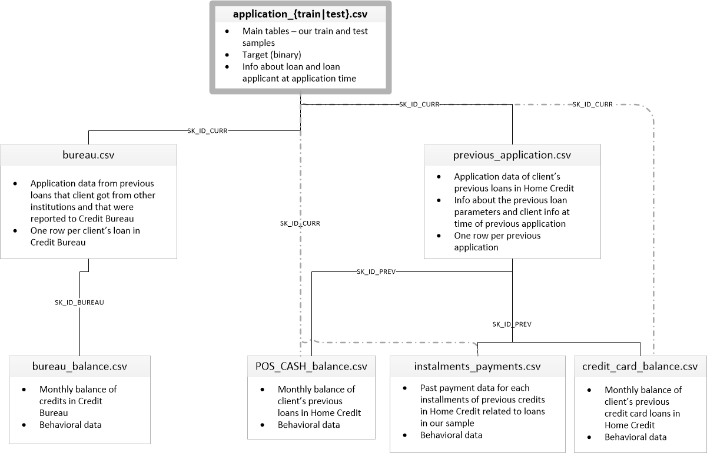

# Credit Risk Model

A machine learning system built on Databricks that simulates a bank's credit scoring decisions. This project predicts whether a loan applicant will default or successfully repay their loan, helping financial institutions make data-driven lending decisions.

## Project Purpose

This project demonstrates end-to-end credit risk modeling using real-world financial data. It aims to:

* Build predictive models to assess loan default risk
* Analyze customer financial behavior and payment patterns
* Create a scalable, production-ready ML pipeline on Databricks
* Implement best practices for credit scoring and risk assessment
* Provide interpretable insights for lending decisions

## Dataset

Built on **Kaggle's Home Credit Default Risk dataset**, which includes:

* Historical loan application data
* Customer demographics and financial information
* Previous credit history and payment records
* External data sources (bureau data, credit card balance, etc.)
* Binary target variable: 0 (loan repaid) or 1 (loan defaulted)

## Technology Stack

* **Platform**: Databricks on AWS
* **Compute**: Serverless compute clusters
* **Language**: Python (PySpark for distributed processing)
* **ML Framework**: Scikit-learn, MLlib, or XGBoost
* **Data Storage**: Delta Lake for reliable data management
* **Orchestration**: Databricks Workflows for pipeline automation

## Key Features

* **Exploratory Data Analysis (EDA)**: Comprehensive analysis of applicant characteristics and default patterns
* **Feature Engineering**: Creation of meaningful features from raw financial data
* **Model Development**: Training and evaluation of multiple classification algorithms
* **Imbalanced Data Handling**: Techniques to address class imbalance in default prediction
* **Model Monitoring**: Tracking model performance and data drift over time

## Project Structure

```
credit-risk-model/
├── README.md                 # Project documentation
├── data/                     # Data storage (raw and processed)
├── notebooks/               # Databricks notebooks for analysis and modeling
│   ├── 01_data_exploration.ipynb
│   ├── 02_feature_engineering.ipynb
│   ├── 03_model_training.ipynb
│   └── 04_model_evaluation.ipynb
└── models/                  # Trained model artifacts
```

## Getting Started

1. **Set up Databricks workspace** on AWS
2. **Upload dataset** to Databricks File System (DBFS) or Unity Catalog volumes
3. **Run notebooks sequentially** to reproduce the analysis and modeling pipeline
4. **Monitor results** through Databricks MLflow for experiment tracking

## Model Evaluation Metrics

* **Accuracy**: Overall prediction correctness
* **Precision/Recall**: Balance between false positives and false negatives
* **ROC-AUC**: Model's ability to distinguish between classes
* **F1-Score**: Harmonic mean of precision and recall
* **Business Metrics**: Expected profit/loss based on lending decisions

## License

This project is for educational and demonstration purposes, built on publicly available Kaggle competition data.